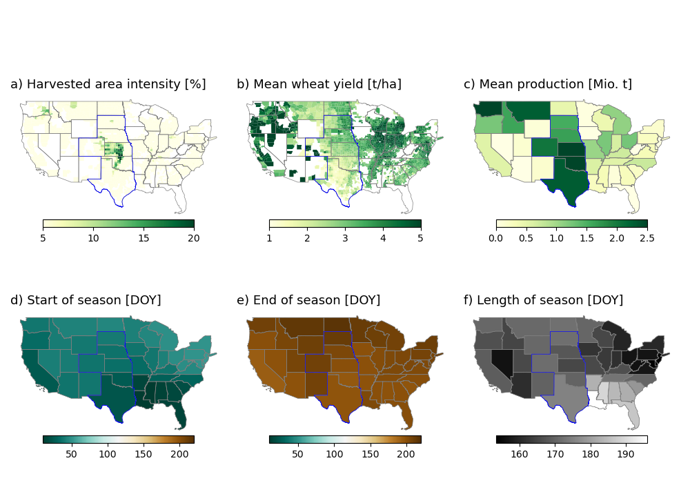
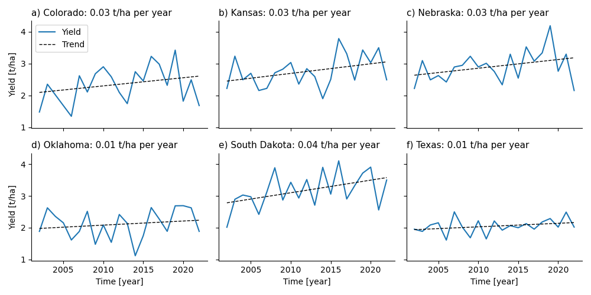
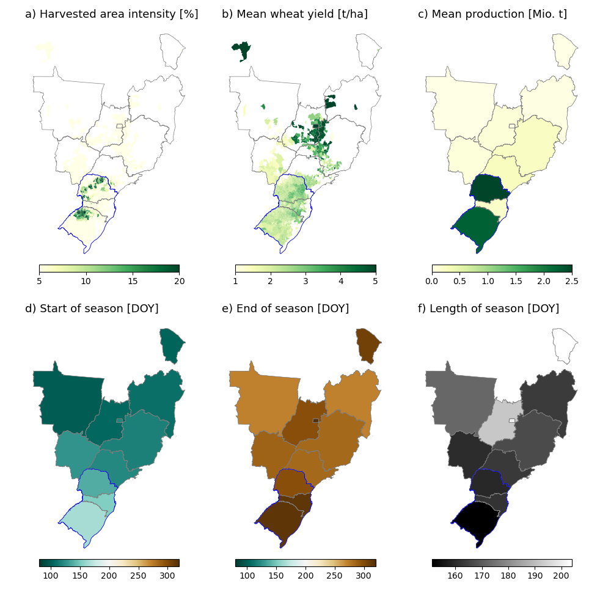

# Wheat yield forecasts with seasonal climate models and long short-term memory networks

## Define study region and test years

**1. WHEAT**

**1.1 USA**

### Crop calendar and study region

For the USA, the Great Plains, inlcuding South Dakota, Nebraska, Colorado, Kansas, Oklahoma and Texas is the heartland of winter wheat production (10). Great plains states are highlighted with a blue border in the figure below. 



### Annual state-level yield and trend

Yield trend in the great plains from 2002-2022 is neglectable. Annual yield data is not detrended, we train a model to estimate absolute yield instead of yield anomalies.



**1.2 BRAZIL**

### Test years

From Nóia Junior et al. (1) - The occurrence of adverse climatic events between June and September are the main cause of wheat yield losses in Brazil.

 - **2006**: National yield dropped by 15% because dry conditions caused a delayed planting, which reduced the potential wheat yield. A combination of drought and hard frosts at the end of August and September further reduced wheat yields (2, 3).
 - **2015**: Yield losses in Santa Catarina and in some parts of Rio Grande do Sul and Paraná. El Nino caused excessive rainfall in the region, increasing the relative humidity. The high relative humidity caused foliar diseases and the sudden high demand in fungicide applications caused production costs to rise by 70% (4).
 - **2017**: The national yield dropped by 36% compared to previous year because of drought and frost conditions during critical development stages of the crop. The drought occurred in June, July, September and October and its effects were magnified by extremely high temperatures (5, 6, 7). 

### Crop calendar



### Study region
Around 90% of Brazilian wheat is produced in the three southern states **Paraná, Santa Catarina, and Rio Grande do Sul** (blue edgecolor in figure above) (7). Our analysis will focus on these three states only, given that they also share a similar cropping season with roughly the same planting and harvest dates and season length. Planting occurs 


### Citation
```
@article{ZACHOW2025110965,
title = {Wheat yield forecasts with seasonal climate models and long short-term memory networks},
journal = {Computers and Electronics in Agriculture},
volume = {239},
pages = {110965},
year = {2025},
issn = {0168-1699},
doi = {https://doi.org/10.1016/j.compag.2025.110965},
url = {https://www.sciencedirect.com/science/article/pii/S0168169925010713},
author = {Maximilian Zachow and Stella Ofori-Ampofo and Harald Kunstmann and Rıdvan Salih Kuzu and Xiao Xiang Zhu and Senthold Asseng},
keywords = {Seasonal climate models, Crop yield, Wheat, Agriculture, LSTM}
}

```
### References

<span style="font-size:0.7em;">

1. Nóia Júnior, R.de S., ...,  Asseng, S, 2021. Extreme Lows of Wheat Production in Brazil, 16, 104025. https://doi.org/10.1088/1748-9326/ac26f3.
2.  F. A. S. USDA, “GAIN Report - Brazil Grain and Feed: An Interesting Year Ahead for Wheat Traders 2006” (2006).
3.  F. A. S. USDA, “GAIN Report - Brazil Grain and Feed Winter Crops Update 2006” (2006).
4. 	G. Paraná, Chuva prejudica produção de trigo, e indústria analisa qualidade do grão. Globo.com (2015).
5. 	A. F. Nunes, Preço do trigo provoca redução da área plantada com o grão no PR. Globo Rural (2017).
6. 	A. Donley, Brazil wheat output to fall in 2017-18. World-Grain.com (2018).
7. 	F. A. S. USDA, “Gain Report - Brazilian Wheat Production, Quality Suffer After Adverse Weather” (2018).
8. IBGE SIDRA, 2022. Tabela 1612: ´Area plantada, ´area colhida, Quantidade produzida, Rendimento Médio e Valor Da Produçao Das Lavouras Temporárias. https://sidra.ibge.gov.br/tabela/1612.
9. USDA (2022). Wheat Outlook: May 2022. https://downloads.usda.library.cornell.edu/usda-esmis/files/cz30ps64c/z316r691k/5m60rx75g/WHS-22e.pdf
10. Zhao, H., Zhang, L., Kirkham, M.B. et al. U.S. winter wheat yield loss attributed to compound hot-dry-windy events. Nat Commun 13, 7233 (2022). https://doi.org/10.1038/s41467-022-34947-6

</span>

