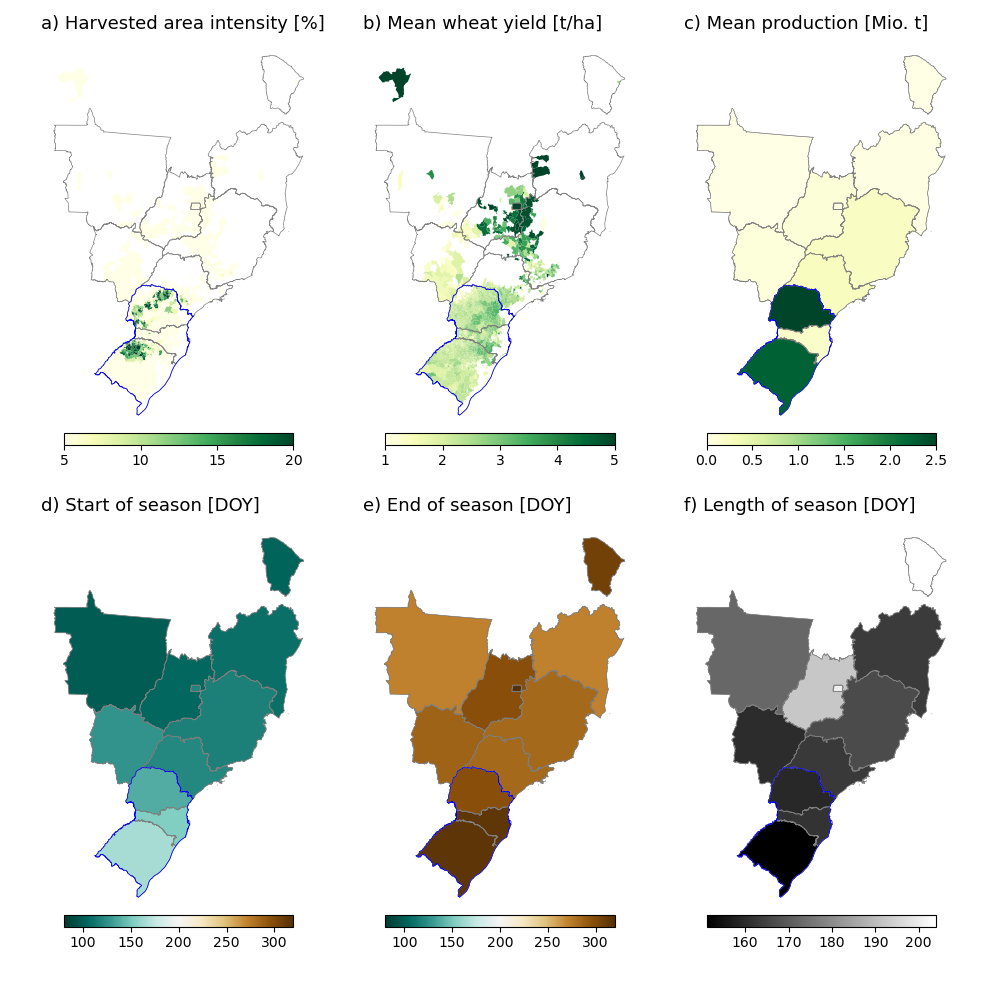

# seasonal-yield-forecast
ML for crop yield forecasting in Brazil and USA using remote sensing data and observed/forecasted climate data.

## Define study region and test years

**1. WHEAT**

**1.1 BRAZIL**

### Test years

From Nóia Junior et al. (1) - The occurrence of adverse climatic events between June and September are the main cause of wheat yield losses in Brazil.

 - **2006**: National yield dropped by 15% because dry conditions caused a delayed planting, which reduced the potential wheat yield. A combination of drought and hard frosts at the end of August and September further reduced wheat yields (2, 3).
 - **2015**: Yield losses in Santa Catarina and in some parts of Rio Grande do Sul and Paraná. El Nino caused excessive rainfall in the region, increasing the relative humidity. The high relative humidity caused foliar diseases and the sudden high demand in fungicide applications caused production costs to rise by 70% (4).
 - **2017**: The national yield dropped by 36% compared to previous year because of drought and frost conditions during critical development stages of the crop. The drought occurred in June, July, September and October and its effects were magnified by extremely high temperatures (5, 6, 7). 

### Crop calendar

### Study region
Around 90% of Brazilian wheat is produced in the three southern states **Paraná, Santa Catarina, and Rio Grande do Sul** (blue edgecolor in figure above) (7). Our analysis will focus on these three states only, given that they also share a similar cropping season with roughly the same planting and harvest dates and season length. Planting occurs 

**1.2 USA**

### Test years

From (9), we identify **2015, 2018 and 2022** as the years with extreme low yields and define them as test years. Wheat production in each of these years was affected by droughts during vegetative stage associated with El Nino/ La Nina or near El Nino/ La Nina conditions (10-13).

### Study region

For the USA, the Great Plains, inlcuding South Dakota, Nebraska, Colorado, Kansas, Oklahoma and Texas is the heartland of winter wheat production (14). But the Great Plains alone only makes up around 50% of total US wheat production from 2002-2022. Since, wheat cultivation is not as concentrated as in Brazil (see above), we decide to keep all states in our study region.

**References**

1. Nóia Júnior, R.de S., ...,  Asseng, S, 2021. Extreme Lows of Wheat Production in Brazil, 16, 104025. https://doi.org/10.1088/1748-9326/ac26f3.
2.  F. A. S. USDA, “GAIN Report - Brazil Grain and Feed: An Interesting Year Ahead for Wheat Traders 2006” (2006).
3.  F. A. S. USDA, “GAIN Report - Brazil Grain and Feed Winter Crops Update 2006” (2006).
4. 	G. Paraná, Chuva prejudica produção de trigo, e indústria analisa qualidade do grão. Globo.com (2015).
5. 	A. F. Nunes, Preço do trigo provoca redução da área plantada com o grão no PR. Globo Rural (2017).
6. 	A. Donley, Brazil wheat output to fall in 2017-18. World-Grain.com (2018).
7. 	F. A. S. USDA, “Gain Report - Brazilian Wheat Production, Quality Suffer After Adverse Weather” (2018).
8. IBGE SIDRA, 2022. Tabela 1612: ´Area plantada, ´area colhida, Quantidade produzida, Rendimento Médio e Valor Da Produçao Das Lavouras Temporárias. https://sidra.ibge.gov.br/tabela/1612.
9. USDA (2024). Winter Wheat: Yield by Year, US https://www.nass.usda.gov/Charts_and_Maps/Field_Crops/wwyld.php
10. USDA (2022). Wheat Outlook: May 2022. https://downloads.usda.library.cornell.edu/usda-esmis/files/cz30ps64c/z316r691k/5m60rx75g/WHS-22e.pdf
11. Braun, Karen (2022). U.S. winter wheat health among worst ever, yield prospects dicey. https://www.reuters.com/markets/commodities/us-winter-wheat-health-among-worst-ever-yield-prospects-dicey-2022-04-06/
12. NOAA (2024). Cold & Warm Episodes by Season. https://origin.cpc.ncep.noaa.gov/products/analysis_monitoring/ensostuff/ONI_v5.php
13. Joel Karlin (2022). Fundamentally Speaking 2022 U.S. Winter Wheat Crop Lowest Since 1970. https://www.dtnpf.com/agriculture/web/ag/blogs/fundamentally-speaking/blog-post/2022/11/29/2022-u-s-winter-wheat-crop-lowest
14. Zhao, H., Zhang, L., Kirkham, M.B. et al. U.S. winter wheat yield loss attributed to compound hot-dry-windy events. Nat Commun 13, 7233 (2022). https://doi.org/10.1038/s41467-022-34947-6

